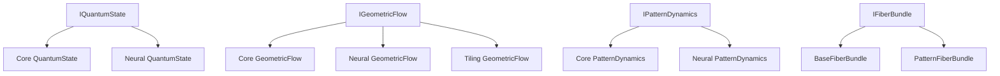

# Class Analysis and Integration Map

## 1. Core Quantum Layer

### State Management
1. Primary Implementations:
   - `core.quantum.state_space.HilbertSpace`
     - Core quantum state management
     - State preparation and evolution
     - Measurement operations
     - Entanglement metrics
     - Density matrix operations
   - `core.quantum.types.QuantumState`
     - Base quantum state representation
     - Core quantum operations
     - Unitary evolution
     - Observable measurements
     - Entanglement properties
   - `neural.attention.pattern.quantum.QuantumState`
     - Pattern-specific quantum states
     - Attention-specific operations
     - Geometric tensor computations
   
   **Integration Issue:** Multiple QuantumState implementations should be unified under a common protocol

### Geometric Flow
1. Core Implementations:
   - `core.quantum.geometric_flow.GeometricFlowAnalyzer`
     - Main geometric flow analysis
     - Ricci flow computation
     - Mean curvature analysis
     - Berry transport
     - Singularity detection
   - `neural.flow.geometric_flow.GeometricFlow`
     - Neural network specific implementation
     - Pattern evolution
     - Flow normalization
     - Energy conservation
   - `core.tiling.geometric_flow.GeometricFlow`
     - Tiling-specific implementation
     - Pattern flow computation
     - Metric evolution
   - `validation.geometric.flow.TilingFlowValidator`
     - Flow validation framework
     - Energy monotonicity
     - Maximum principle checks
     - Long-time existence

   **Integration Issue:** Four separate geometric flow implementations need unification

### Path Integral System
1. Core Classes:
   - `core.quantum.path_integral.Path`
     - Path representation
     - Action computation
     - Path variations
   - `core.quantum.path_integral.ActionFunctional`
     - Action functional computation
     - Variation principles
     - Energy conservation
   - `core.quantum.path_integral.PathSampler`
     - Monte Carlo sampling
     - Importance weighting
     - Path generation
   - `core.quantum.path_integral.Propagator`
     - Time evolution
     - Green's functions
     - Correlation functions
   - `core.quantum.path_integral.StationaryPhase`
     - Stationary phase approximation
     - Saddle point analysis
     - WKB approximation

## 2. Pattern System Layer

### Base Pattern Framework
1. Core Pattern Classes:
   - `core.patterns.dynamics.PatternDynamics`
     - Base pattern evolution
     - Reaction-diffusion dynamics
     - Stability analysis
     - Bifurcation detection
   - `neural.attention.pattern.dynamics.PatternDynamics`
     - Attention-specific dynamics
     - Pattern control
     - Evolution optimization
   - `core.patterns.formation.PatternFormation`
     - Pattern generation
     - Formation analysis
     - Stability measures
     - Mode decomposition

   **Integration Issue:** Duplicate PatternDynamics implementations need unification

### Riemannian Framework
1. Core Classes:
   - `core.patterns.riemannian_base.RiemannianStructure`
     - Base geometric structure
     - Metric tensor operations
     - Connection computation
     - Curvature analysis
   - `core.patterns.riemannian.PatternRiemannianStructure`
     - Pattern-specific geometry
     - Pattern metric tensor
     - Evolution geodesics
   - `core.tiling.patterns.cohomology.MotivicRiemannianStructure`
     - Motivic integration
     - Height theory
     - L-functions
     - Arithmetic dynamics

### Fiber Bundle System
1. Core Classes:
   - `core.patterns.fiber_bundle.BaseFiberBundle`
     - Core fiber bundle operations
     - Bundle projection
     - Local trivialization
     - Connection forms
     - Parallel transport
   - `core.tiling.patterns.fiber_bundle.PatternFiberBundle`
     - Pattern-specific bundles
     - Pattern sections
     - Bundle metrics
     - Transition functions

## 5. Recommended Interfaces

### Quantum Interfaces
1. `IQuantumState`:
   ```python
   class IQuantumState(Protocol):
       def evolve(self, hamiltonian: Tensor, time: float) -> 'IQuantumState': ...
       def measure(self, observable: Tensor) -> Tuple[Tensor, float]: ...
       def to_density_matrix(self) -> Tensor: ...
       def compute_entropy(self) -> float: ...
       def entanglement_witness(self) -> EntanglementMetrics: ...
       def parallel_transport(self, connection: Tensor) -> 'IQuantumState': ...
   ```

2. `IGeometricFlow`:
   ```python
   class IGeometricFlow(Protocol):
       def compute_flow(self, state: IQuantumState, time: float) -> Tensor: ...
       def flow_step(self, state: IQuantumState, dt: float) -> IQuantumState: ...
       def compute_metric(self, state: IQuantumState) -> Tensor: ...
       def compute_ricci_tensor(self, metric: Tensor) -> Tensor: ...
       def detect_singularities(self, flow: Tensor) -> List[Singularity]: ...
       def normalize_flow(self, flow: Tensor) -> Tensor: ...
   ```

### Pattern Interfaces
1. `IPatternDynamics`:
   ```python
   class IPatternDynamics(Protocol):
       def evolve(self, state: Tensor, time: float) -> Tensor: ...
       def compute_stability(self, state: Tensor) -> StabilityMetrics: ...
       def analyze_formation(self, state: Tensor) -> FormationMetrics: ...
       def reaction_diffusion(self, state: Tensor, 
                            diffusion: Tensor, 
                            reaction: Callable) -> Tensor: ...
       def bifurcation_analysis(self, state: Tensor, 
                              parameter: Tensor) -> BifurcationDiagram: ...
   ```

2. `IFiberBundle`:
   ```python
   class IFiberBundle(Protocol):
       def bundle_projection(self, total_space: Tensor) -> BaseSpace: ...
       def local_trivialization(self, point: Tensor) -> Tuple[Chart, Chart]: ...
       def transition_functions(self, chart1: Chart, chart2: Chart) -> TransitionMap: ...
       def connection_form(self, tangent: Tensor) -> ConnectionForm: ...
       def parallel_transport(self, section: Tensor, path: Tensor) -> Tensor: ...
       def compute_curvature(self, point: Tensor) -> CurvatureTensor: ...
   ```

## 6. Integration Priorities

1. Quantum State Management:
   - Create unified IQuantumState interface with complete quantum operations
   - Merge duplicate implementations preserving specialized functionality
   - Standardize state operations across all layers
   - Implement comprehensive validation suite

2. Geometric Flow:
   - Implement IGeometricFlow interface with full geometric operations
   - Consolidate flow implementations maintaining specializations
   - Unify validation framework with complete coverage
   - Add performance optimizations

3. Pattern System:
   - Create IPatternDynamics interface with complete pattern operations
   - Merge duplicate dynamics implementations
   - Standardize pattern operations across layers
   - Implement comprehensive validation

4. Validation Framework:
   - Implement unified validation protocols for all components
   - Create cross-layer validation with complete coverage
   - Add comprehensive testing for all operations
   - Implement performance validation

## 7. Dependency Graph



## 8. Next Steps

1. Interface Definition:
   - Create core protocol files
   - Define clear interfaces
   - Document requirements

2. Implementation Consolidation:
   - Merge quantum state implementations
   - Unify geometric flow code
   - Consolidate pattern dynamics

3. Validation Enhancement:
   - Implement cross-layer validation
   - Add interface compliance tests
   - Create integration tests

4. Documentation:
   - Update class documentation
   - Create interface guides
   - Add integration examples 