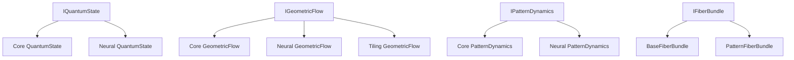

# Class Analysis and Integration Map

## 1. Core Quantum Layer

### State Management
1. Primary Implementations:
   - `core.quantum.state_space.HilbertSpace`
     - Core quantum state management
     - State preparation and evolution
     - Measurement operations
   - `core.quantum.types.QuantumState`
     - Base quantum state representation
     - Core quantum operations
   - `neural.attention.pattern.quantum.QuantumState`
     - Duplicate implementation
     - Pattern-specific quantum states
   
   **Integration Issue:** Multiple QuantumState implementations should be unified

### Geometric Flow
1. Core Implementations:
   - `core.quantum.geometric_flow.GeometricFlowAnalyzer`
     - Main geometric flow analysis
     - Ricci flow computation
     - Mean curvature analysis
   - `neural.flow.geometric_flow.GeometricFlow`
     - Neural network specific implementation
     - Pattern evolution
   - `core.tiling.geometric_flow.GeometricFlow`
     - Tiling-specific implementation
   - `validation.geometric.flow.TilingFlowValidator`
     - Flow validation framework

   **Integration Issue:** Four separate geometric flow implementations

### Path Integral System
1. Core Classes:
   - `core.quantum.path_integral.Path`
   - `core.quantum.path_integral.ActionFunctional`
   - `core.quantum.path_integral.PathSampler`
   - `core.quantum.path_integral.Propagator`
   - `core.quantum.path_integral.StationaryPhase`

## 2. Pattern System Layer

### Base Pattern Framework
1. Core Pattern Classes:
   - `core.patterns.dynamics.PatternDynamics`
     - Base pattern evolution
   - `neural.attention.pattern.dynamics.PatternDynamics`
     - Duplicate implementation
   - `core.patterns.formation.PatternFormation`
     - Pattern generation and analysis

   **Integration Issue:** Duplicate PatternDynamics implementations

### Riemannian Framework
1. Core Classes:
   - `core.patterns.riemannian_base.RiemannianStructure`
     - Base geometric structure
   - `core.patterns.riemannian.PatternRiemannianStructure`
     - Pattern-specific geometry
   - `core.tiling.patterns.cohomology.MotivicRiemannianStructure`
     - Motivic integration

### Fiber Bundle System
1. Core Classes:
   - `core.patterns.fiber_bundle.BaseFiberBundle`
     - Core fiber bundle operations
   - `core.tiling.patterns.fiber_bundle.PatternFiberBundle`
     - Pattern-specific bundles

## 3. Validation Layer

### Quantum Validation
1. Core Classes:
   - `validation.quantum.state.QuantumStateValidator`
     - State validation
   - `validation.quantum.evolution.QuantumEvolutionValidator`
     - Evolution validation

### Pattern Validation
1. Core Classes:
   - `validation.patterns.formation.PatternFormationValidator`
     - Formation validation
   - `validation.patterns.stability.PatternValidator`
     - Stability validation

### Geometric Validation
1. Core Classes:
   - `validation.geometric.metric.GeometricMetricValidator`
     - Metric validation
   - `validation.geometric.motivic.MotivicRiemannianValidator`
     - Motivic structure validation

## 4. Neural Layer

### Attention System
1. Core Classes:
   - `neural.attention.pattern.models.AttentionModel`
     - Pattern attention
   - `neural.attention.pattern.quantum.QuantumGeometricTensor`
     - Quantum attention

### Flow System
1. Core Classes:
   - `neural.flow.geometric_flow.FlowMetrics`
   - `neural.flow.geometric_flow.FlowStepNetwork`
   - `neural.flow.hamiltonian.HamiltonianFlow`

## 5. Recommended Interfaces

### Quantum Interfaces
1. `IQuantumState`:
   ```python
   class IQuantumState(Protocol):
       def evolve(self, hamiltonian: Tensor) -> 'IQuantumState': ...
       def measure(self, observable: Tensor) -> Tensor: ...
       def to_density_matrix(self) -> Tensor: ...
   ```

2. `IGeometricFlow`:
   ```python
   class IGeometricFlow(Protocol):
       def compute_flow(self, state: IQuantumState) -> Tensor: ...
       def flow_step(self, state: IQuantumState, dt: float) -> IQuantumState: ...
       def compute_metric(self, state: IQuantumState) -> Tensor: ...
   ```

### Pattern Interfaces
1. `IPatternDynamics`:
   ```python
   class IPatternDynamics(Protocol):
       def evolve(self, state: Tensor) -> Tensor: ...
       def compute_stability(self, state: Tensor) -> Dict[str, Any]: ...
       def analyze_formation(self, state: Tensor) -> Dict[str, Any]: ...
   ```

2. `IFiberBundle`:
   ```python
   class IFiberBundle(Protocol):
       def parallel_transport(self, section: Tensor, path: Tensor) -> Tensor: ...
       def compute_connection(self, point: Tensor) -> Tensor: ...
       def compute_curvature(self, point: Tensor) -> Tensor: ...
   ```

## 6. Integration Priorities

1. Quantum State Management:
   - Create unified IQuantumState interface
   - Merge duplicate implementations
   - Standardize state operations

2. Geometric Flow:
   - Implement IGeometricFlow interface
   - Consolidate flow implementations
   - Unify validation framework

3. Pattern System:
   - Create IPatternDynamics interface
   - Merge duplicate dynamics implementations
   - Standardize pattern operations

4. Validation Framework:
   - Implement unified validation protocols
   - Create cross-layer validation
   - Add comprehensive testing

## 7. Dependency Graph



## 8. Next Steps

1. Interface Definition:
   - Create core protocol files
   - Define clear interfaces
   - Document requirements

2. Implementation Consolidation:
   - Merge quantum state implementations
   - Unify geometric flow code
   - Consolidate pattern dynamics

3. Validation Enhancement:
   - Implement cross-layer validation
   - Add interface compliance tests
   - Create integration tests

4. Documentation:
   - Update class documentation
   - Create interface guides
   - Add integration examples 