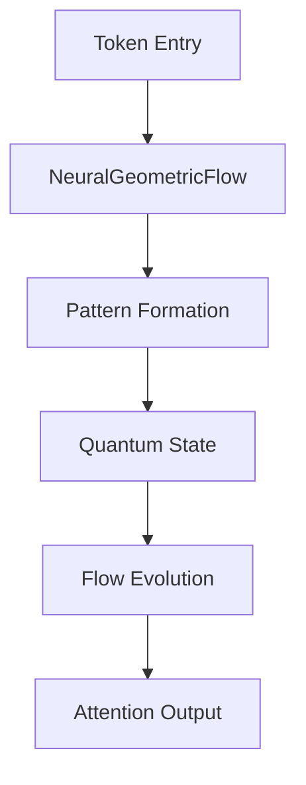

# Comprehensive System Architecture and Implementation Plan

## 1. Current System Analysis

### 1.1 Core Issues
1. **Circular Dependencies**
   - `motivic_integration.py` imports from `arithmetic_dynamics.py`
   - `arithmetic_dynamics.py` contains `MotivicIntegrator` which belongs in `motivic_integration.py`
   - Quantum corrections are split across multiple files

2. **Misplaced Components**
   - `ArithmeticDynamics` is in tiling but used primarily by patterns
   - Cohomology structures are in tiling/patterns but used by core/patterns
   - Quantum corrections lack clear ownership

### 1.2 Implementation Status

#### Core Files
- [x] `src/core/patterns/pattern_fiber_bundle.py`
  - Main integration point
  - Has Riemannian, symplectic, and motivic structures
  - Needs quantum and crystal enhancements
- [x] `src/core/patterns/motivic_riemannian.py`
  - Arithmetic-geometric bridge
  - Needs quantum corrections
- [x] `src/core/patterns/arithmetic_dynamics.py`
  - Height theory and dynamics
  - Needs crystal structure integration
- [ ] `src/core/patterns/symplectic.py`
  - Needs quantum geometric tensor completion
- [ ] `src/core/quantum/crystal.py`
  - Needs wave structure compatibility

## 2. New Architecture

### 2.1 File Structure
```
src/core/
├── patterns/
│   ├── motivic_integration.py
│   │   - MotivicIntegrator
│   │   - MotivicIntegrationSystem
│   │   - Integration utilities
│   ├── arithmetic_dynamics.py
│   │   - ArithmeticDynamics
│   │   - Height functions
│   │   - L-functions
│   └── cohomology.py
│       - Cohomology structures
│       - Intersection theory
└── tiling/
    ├── quantum_attention_tile.py
    │   - Quantum attention mechanisms
    │   - Tiling primitives
    └── quantum_geometric_attention.py
        - Geometric flow
        - Attention patterns
```

### 2.2 Component Responsibilities

#### MotivicIntegrator
- Handle integration over motivic spaces
- Manage integration parameters
- Coordinate with arithmetic dynamics

#### ArithmeticDynamics
- Compute height functions
- Handle L-functions
- Manage arithmetic flow

#### QuantumAttentionTile
- Implement quantum attention mechanisms
- Handle tiling operations
- Manage geometric patterns

## 3. Integration Plan

### 3.1 Primary Flow Sequence


### 3.2 Integration Points
1. **Pattern-Neural-Quantum Triangle**
   - Pattern space forms Riemannian manifold with Fisher-Rao metric
   - Neural components preserve geometric structure
   - Quantum states reflect pattern topology

2. **Information Geometry Bridge**
   ```math
   G_ij(θ) = ∫ ∂_i log p(x|θ) ∂_j log p(x|θ) p(x|θ) dx
   ```
   - Metric informs neural and quantum state transitions
   - Parallel transport preserves information geometry
   - Curvature indicates interaction strength

3. **Scale Transition System**
   ```math
   S_λ: Pat_μ → Pat_λ
   S_λ ∘ S_μ = S_{λμ}
   ```
   - Compositional structure preserves quantum coherence
   - Scale transitions respect pattern hierarchy
   - Natural integration with scale_transition.py

## 4. Implementation Priorities

### Phase 1: Core Enhancements
1. [ ] Complete quantum geometric tensor in `PatternFiberBundle`
2. [ ] Add wave structure to `BravaisLattice`
3. [ ] Enhance height theory in `ArithmeticDynamics`

### Phase 2: Integration
1. [ ] Connect crystal structure with arithmetic dynamics
2. [ ] Strengthen geometric-arithmetic bridge
3. [ ] Improve quantum-classical interface

### Phase 3: Testing
1. [ ] Implement quantum correction tests
2. [ ] Add crystal integration tests
3. [ ] Create structure preservation tests

## 5. Validation Framework

### 5.1 Core Tests
- [ ] Token flow validation
- [ ] Quantum state fidelity
- [ ] Flow stability
- [ ] Attention accuracy

### 5.2 Integration Tests
- [ ] End-to-end token flow
- [ ] State preparation quality
- [ ] Evolution stability
- [ ] Performance metrics

### 5.3 Performance Validation
- [ ] Pattern detection accuracy
- [ ] Quantum evolution stability
- [ ] Geometric flow preservation
- [ ] Scale transition accuracy

## 6. Implementation Steps

1. **File Moves**
   - Move `arithmetic_dynamics.py` from tiling to patterns
   - Move cohomology structures to dedicated file
   - Consolidate quantum corrections

2. **Dependency Resolution**
   - Extract `MotivicIntegrator` from `arithmetic_dynamics.py`
   - Update imports to reflect new structure
   - Remove circular dependencies

3. **Interface Cleanup**
   - Define clear interfaces between components
   - Document component responsibilities
   - Add type hints and docstrings

## 7. Migration Timeline

1. Create new file structure
2. Move files to new locations
3. Update imports and dependencies
4. Add documentation and tests
5. Verify system functionality

## 8. Critical Components

### 8.1 Quantum Bridge Integration
```python
def compute_quantum_metric(self, points: Tensor) -> Tensor:
    # Add quantum geometric tensor Q_{μν} = g_{μν} + iω_{μν}
    g_μν = self.riemannian_framework.compute_metric(points)
    ω_μν = self.symplectic_structure.compute_form(points)
    return self._combine_quantum_metric(g_μν, ω_μν)
```

### 8.2 Crystal Structure Enhancement
```python
def compute_band_structure(self, points: Tensor) -> Tensor:
    # Add wave structure integration
    wave_data = self.wave_structure.compute(points)
    return self._compute_bands(wave_data)
```

### 8.3 Height Theory Integration
```python
def compute_height(self, x: Tensor) -> Tensor:
    # Add quantum and crystal corrections
    classical = self.height_map(x)
    quantum = self.quantum_height(x)
    crystal = self.crystal_height(x)
    return self._combine_heights(classical, quantum, crystal)
```

## 9. Dependencies
- PyTorch: Core tensor operations
- NumPy: Numerical computations
- TorchTyping: Runtime shape checking

## 10. Next Steps
1. Review quantum tensor implementation in `PatternFiberBundle`
2. Complete wave structure integration in `BravaisLattice`
3. Add comprehensive tests
4. Optimize performance
5. Add example notebooks

Last Updated: 2024-12-20 