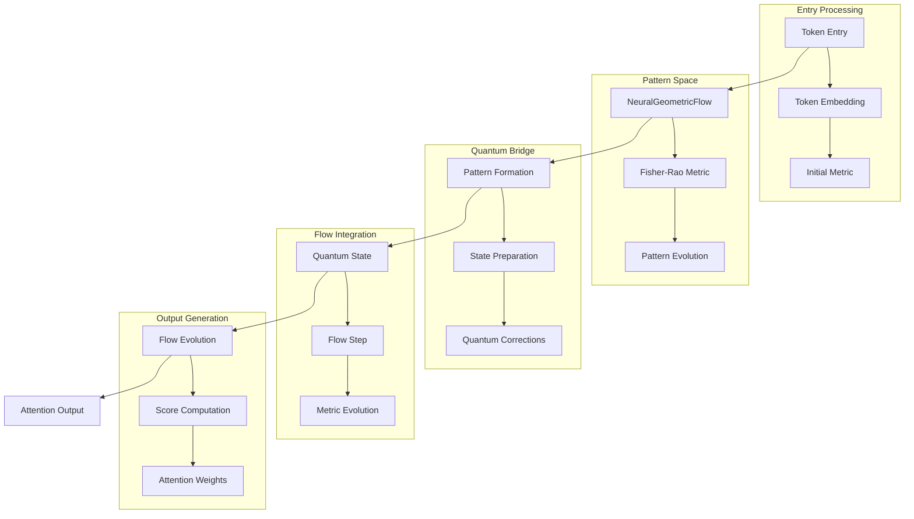
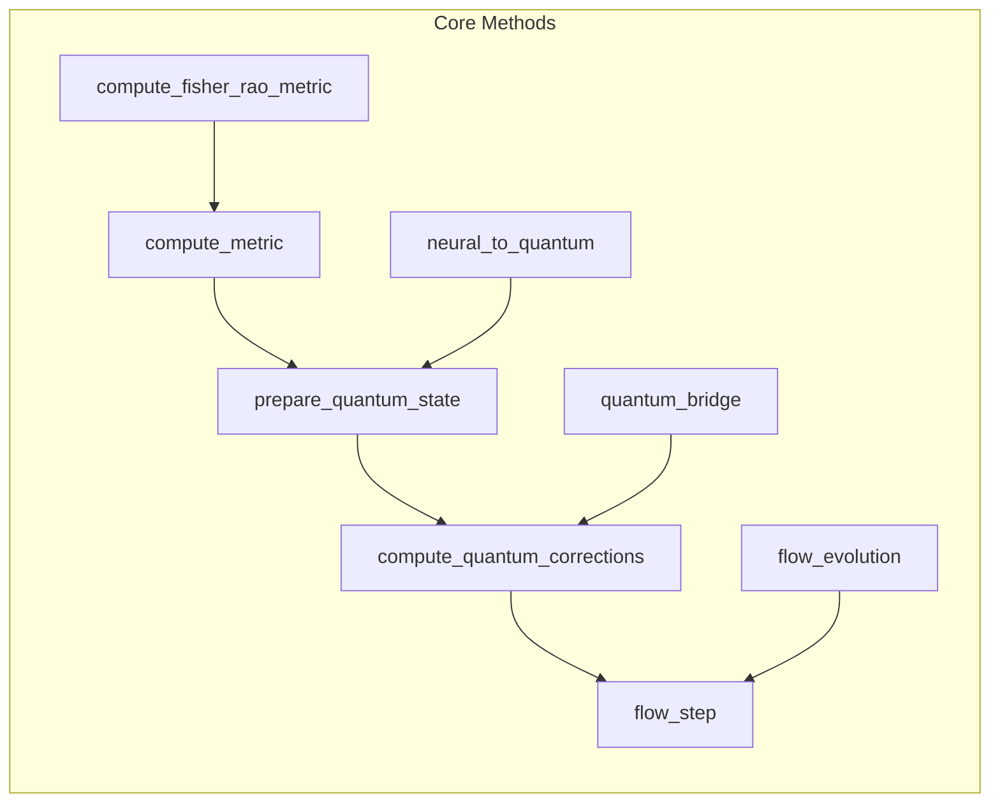
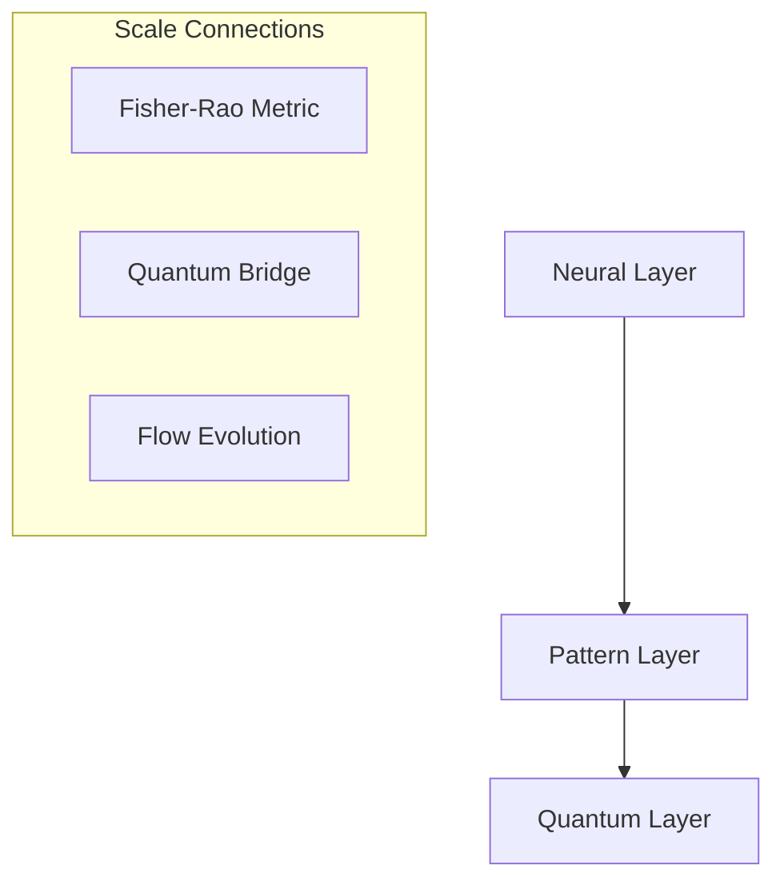

# Component Analysis and Integration Map

## 1. Information Flow Architecture

### A. Primary Flow Sequence


### B. Integration Points


## 2. Component Relationships

### A. Core Flow Structure
1. Entry Point (`NeuralGeometricFlow`)
   ```python
   compute_metric
   ├── Pattern Metric
   ├── Fisher-Rao Metric
   └── Quantum Corrections
   ```
   
2. Pattern Formation
   ```python
   PatternFormationFlow
   ├── Pattern Evolution
   ├── Stability Analysis
   └── Scale Transitions
   ```

3. Quantum Integration
   ```python
   NeuralQuantumBridge
   ├── State Preparation
   ├── Evolution
   └── Measurement
   ```

### B. Information Flow Points

1. Pattern Formation
   ```mermaid
   graph LR
       A[Token Input] --> B[compute_metric]
       B --> C[Pattern Evolution]
       C --> D[Quantum State]
   ```

2. Quantum Processing
   ```mermaid
   graph LR
       A[Pattern State] --> B[prepare_quantum_state]
       B --> C[quantum_corrections]
       C --> D[flow_step]
   ```

3. Flow Evolution
   ```mermaid
   graph LR
       A[Quantum State] --> B[Flow Metrics]
       B --> C[Evolution]
       C --> D[Attention]
   ```

## 3. Scale Transitions

### A. Vertical Integration


### B. Horizontal Flow
1. Information Current
   ```math
   J[p] = -D∇p + v(p)
   ```

2. Quantum Evolution
   ```math
   ρ(t) = U(t)ρ₀U^†(t)
   ```

## 4. Key Insights

1. Token Flow Path:
   - Entry through `NeuralGeometricFlow.compute_metric`
   - Pattern formation via Fisher-Rao metric
   - Quantum state preparation and evolution
   - Flow step computation
   - Attention score generation

2. Integration Structure:
   - Clear vertical integration through layers
   - Consistent information flow
   - Scale-aware transitions
   - Quantum corrections at each step

3. Critical Components:
   - Fisher-Rao metric computation
   - Quantum state preparation
   - Flow evolution
   - Metric tensor management

## 5. Next Steps

1. Implementation Focus:
   - Optimize token entry flow
   - Enhance quantum corrections
   - Improve scale transitions
   - Refine attention generation

2. Validation Points:
   - Token flow correctness
   - Quantum state fidelity
   - Flow stability
   - Attention accuracy

*Note: This analysis reflects the theoretical framework from the connections documents and current implementation.*