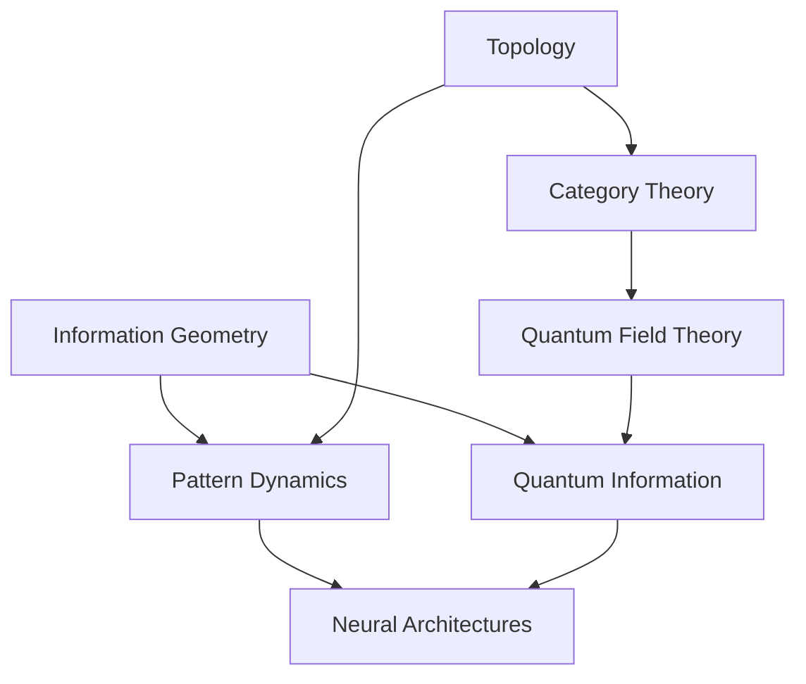
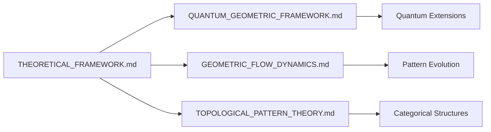
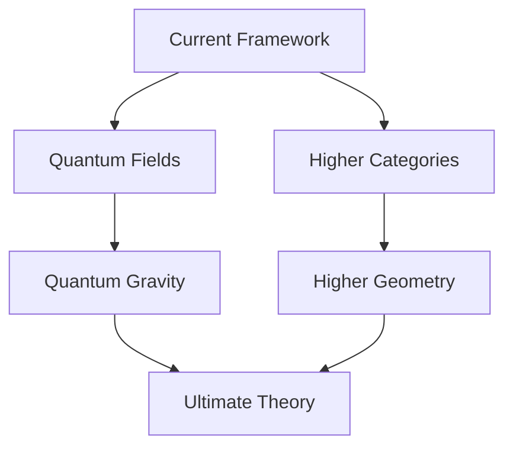

# Unified Framework: Theoretical Connections and Roadmap

## Framework Overview

This document serves as a navigation guide through our theoretical framework, highlighting the key connections between different mathematical domains and their practical applications in neural architectures.



## 1. Core Mathematical Foundations

### 1.1 Primary Theoretical Pillars

| Domain | Key Concepts | Connected To | Implementation Impact |
|--------|--------------|--------------|----------------------|
| Information Geometry | Fisher metric, geodesics | Pattern dynamics, quantum information | Adaptive computation |
| Algebraic Topology | Persistent homology, sheaves | Category theory, pattern recognition | Feature detection |
| Category Theory | Functors, natural transformations | Quantum structures, pattern spaces | Architecture design |
| Quantum Theory | Statistical manifolds, non-commutativity | Information geometry, field theory | Quantum acceleration |

### 1.2 Cross-Domain Connections

#### Information Geometry Topology
```math
Pattern Space = (M, g, ∇) + H*(M)
```
where:
- (M, g, ∇): Information manifold
- H*(M): Homology structure

#### Topology Category Theory
```math
Pat_∞(X,Y) ≃ Map(X,Y)_{homotopy}
```
connecting:
- Pattern categories
- Topological spaces
- Homotopy types

## 2. Theoretical Framework Navigation

### 2.1 Document Dependencies



### 2.2 Reading Path Recommendations

1. **Foundation Track**:
   - THEORETICAL_FRAMEWORK.md
   - GEOMETRIC_FLOW_DYNAMICS.md
   - TOPOLOGICAL_PATTERN_THEORY.md

2. **Quantum Track**:
   - THEORETICAL_FRAMEWORK.md
   - QUANTUM_GEOMETRIC_FRAMEWORK.md
   - Quantum extensions

3. **Implementation Track**:
   - THEORETICAL_FRAMEWORK.md
   - IMPLEMENTATION_SPEC.md
   - VULKAN_IMPLEMENTATION.md

## 3. Key Theoretical Bridges

### 3.1 Information Quantum

The bridge from classical to quantum information geometry:

```math
Classical Manifold → Quantum Statistical Manifold
(M, g_{ij}) → (S(H), G_Q)
```

### 3.2 Topology Geometry

Connection between persistent homology and geometric flows:

```math
H_*(M_t) ↔ Ricci Flow
```

### 3.3 Category Implementation

Categorical structures to neural architectures:

```python
class GeometricNeuralNetwork(nn.Module):
    """
    Implementation guided by categorical principles
    - Objects: Layer spaces
    - Morphisms: Transformations
    - Functors: Architecture patterns
    """
    def __init__(self):
        self.layers = PatternCategory()
        self.transforms = FunctorCategory()
```

## 4. Framework Connection Slices

### 4.1 Theoretical Views

Our framework can be viewed through different theoretical "slices", each revealing different aspects of the underlying structure:

| Slice | Focus | Key Connections |
|-------|-------|----------------|
| Crystal Structure | Theory refraction patterns | Quantum Geometric Information |
| Scale Cohomology | Pattern repetition across scales | Quantum strings Cosmic strings |
| Recursive Patterns | Self-referential structures | Meta-patterns Strange loops |
| Symmetry | Invariant structures | Quantum Geometric Classical |
| Information Flow | Pattern transport | Quantum Classical Emergence |
| Algebraic Fixed Points | Operation convergence | Addition Multiplication Exponentiation |

### 4.2 Cross-Slice Connections

```math
Slice_{ij} = Slice_i ∩ Slice_j
```

Key intersections:
- Crystal-Scale: Pattern repetition symmetries
- Scale-Recursive: Self-similar structures
- Recursive-Information: Self-referential flows
- Information-Symmetry: Conserved quantities
- Symmetry-Algebraic: Fixed point structures
- Algebraic-Crystal: Operation geometries

## 5. Practical Applications Roadmap

### 5.1 Theory Practice Bridges

| Theoretical Concept | Mathematical Structure | Implementation | Application |
|--------------------|------------------------|----------------|--------------|
| Pattern Categories | Pat_∞ | PatternNetwork | Feature Detection |
| Geometric Flows | ∂_t g = -2Ric | FlowLayer | Dynamic Routing |
| Quantum States | ρ ∈ S(H) | QuantumLayer | Quantum Acceleration |

### 5.2 Implementation Guidelines

```python
# Example: Bridging theory and practice
class TheoreticalBridge:
    def __init__(self):
        self.pattern_space = PatternSpace()
        self.quantum_state = QuantumState()
        self.flow = GeometricFlow()
    
    def connect_structures(self):
        """Connect theoretical structures to implementations"""
        # Pattern recognition
        patterns = self.pattern_space.detect_patterns()
        
        # Quantum processing
        quantum_patterns = self.quantum_state.process(patterns)
        
        # Geometric evolution
        evolved_patterns = self.flow.evolve(quantum_patterns)
        
        return evolved_patterns
```

## 6. Research Connections

### 6.1 Current Frontiers

1. **Quantum Field Theory Connection**
   - Path integrals in pattern spaces
   - Quantum field patterns
   - Geometric quantization

2. **Higher Category Theory**
   - (∞,n)-pattern categories
   - Higher pattern stacks
   - Derived pattern geometry

### 6.2 Future Directions



## 7. Deep Unification: The Symmetry Principle

### Matrix-Symmetry Correspondence

```math
M: V → V ≅ ρ: G → GL(V)
```

Every matrix is a representation of symmetries:
- Linear transformations Group actions
- Eigenspaces Irreducible representations
- Matrix operations Symmetry compositions

### Universal Pattern Language

The realization that matrices encode symmetries provides a universal language:
1. **Quantum States** = Symmetry representations in Hilbert space
2. **Neural Networks** = Learned symmetry transformations
3. **Geometric Flows** = Continuous symmetry deformations
4. **Information Transport** = Symmetry-preserving maps

This unification reveals why our framework naturally connects:
- Information geometry with quantum mechanics
- Neural architectures with pattern dynamics
- Emergence with symmetry breaking
- Complexity with symmetry groups

As the saying goes: "There's a day before and after you understand everything is just symmetries."

## 8. Navigation Guidelines

### 8.1 For Theorists

1. Start with THEORETICAL_FRAMEWORK.md
2. Focus on mathematical structures
3. Follow category theory connections
4. Explore quantum extensions

### 8.2 For Implementers

1. Start with IMPLEMENTATION_SPEC.md
2. Focus on practical bridges
3. Follow code examples
4. Implement core structures

## 9. Document Cross-References

### 9.1 Theoretical Connections

| Document | Key Concepts | Connected To |
|----------|--------------|--------------|
| THEORETICAL_FRAMEWORK | Core theory | All documents |
| QUANTUM_GEOMETRIC | Quantum structures | Geometric flows |
| GEOMETRIC_FLOW | Pattern evolution | Topology |
| TOPOLOGICAL_PATTERN | Categorical foundation | Quantum theory |

### 9.2 Implementation Connections

| Component | Theoretical Basis | Implementation |
|-----------|------------------|----------------|
| PatternNetwork | Category theory | Neural network |
| QuantumLayer | Quantum geometry | GPU acceleration |
| FlowLayer | Geometric flows | Pattern evolution |

## 10. Future Integration Points

### 10.1 Theoretical Extensions

1. **Quantum Gravity**
   - Pattern spaces in quantum geometry
   - Holographic principles
   - Quantum pattern emergence

2. **Higher Structures**
   - (∞,n)-pattern categories
   - Higher pattern topoi
   - Derived pattern geometry

### 10.2 Implementation Extensions

1. **Quantum Computing**
   - Quantum pattern processors
   - Quantum neural architectures
   - Hybrid classical-quantum systems

2. **Advanced Neural Architectures**
   - Geometric attention mechanisms
   - Topological layer design
   - Category-theoretic networks

## References

1. For theoretical foundations:
   - THEORETICAL_FRAMEWORK.md
   - QUANTUM_GEOMETRIC_FRAMEWORK.md
   - GEOMETRIC_FLOW_DYNAMICS.md
   - TOPOLOGICAL_PATTERN_THEORY.md

2. For implementations:
   - IMPLEMENTATION_SPEC.md
   - VULKAN_IMPLEMENTATION.md
   - METRICS.md

## Appendices

### A. Mathematical Prerequisites

1. **Category Theory**
   - Basic categories and functors
   - Natural transformations
   - Higher categories

2. **Differential Geometry**
   - Manifolds and metrics
   - Connections and curvature
   - Geometric flows

3. **Quantum Theory**
   - Quantum states
   - Non-commutative geometry
   - Quantum information
